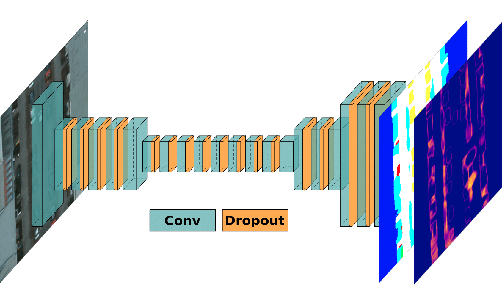

# Bayesian ERFNet - Pytorch Lightning Implementation

This repository is a submodule of our paper "An Informative Path Planning Framework for Active Learning in UAV-based Semantic Mapping". The repository provides Pytorch Lightning implementations to train and
evaluate our proposed general Bayesian ERFNet framework for semantic segmentation quantifying per-pixel model uncertainty using ensembles and Monte-Carlo 
dropout. The paper can be found [here](https://arxiv.org/abs/2302.03347). If you found this work useful for your own research, feel free to cite it.

```commandline
@article{ruckin2023informativeframework,
  title={{An Informative Path Planning Framework for Active Learning in UAV-based Semantic Mapping}},
  author={R{\"u}ckin, Julius and Magistri, Federico and Stachniss, Cyrill and Popovi{\'c}, Marija},
  journal={arXiv preprint arXiv:2302.03347},
  year={2023},
}
```

## Network Overview



Our Bayesian ERFNet architecture for probabilistic semantic segmentation. 
We extend the network of Romera et al. with Monte-Carlo dropout (orange layers) to predict model uncertainty. 
Our network takes as input RGB (left) and outputs semantic labels (second from right) and pixel-wise uncertainty (first from right).

## Installation & Setup

```bash
pip3 install -r requirements.txt
```

### Docker

Requires [docker](https://docs.docker.com/get-docker/) and [docker-compose](https://docs.docker.com/compose/install/).

First, build the pipeline:
```bash
docker-compose build
```

To start the training pipeline and tensorboard:
```bash
docker-compose up
```

## Development

### Style Guidelines

In general, we follow the Python [PEP 8](https://www.python.org/dev/peps/pep-0008/) style guidelines. Please install [black](https://pypi.org/project/black/) to format your python code properly.
To run the black code formatter, use the following command:

```commandline
black -l 120 path/to/python/module/or/package/
```

To optimize and clean up your imports, feel free to have a look at this solution for [PyCharm](https://www.jetbrains.com/pycharm/guide/tips/optimize-imports/).

### Maintainer

Julius Rückin, [jrueckin@uni-bonn.de](mailto:jrueckin@uni-bonn.de), Ph.D. student at [PhenoRob - University of Bonn](https://www.phenorob.de/)

## Acknowledgement

We would like to thank Jan Weyler for providing a PyTorch Lightning implementation of ERFNet.
Our Bayesian-ERFNet implementation builds upon Jan's ERFNet implementation. 

## Funding

This work was funded by the Deutsche Forschungsgemeinschaft (DFG,
German Research Foundation) under Germany’s Excellence Strategy - EXC
2070 – 390732324. Authors are with the Cluster of Excellence PhenoRob,
Institute of Geodesy and Geoinformation, University of Bonn.